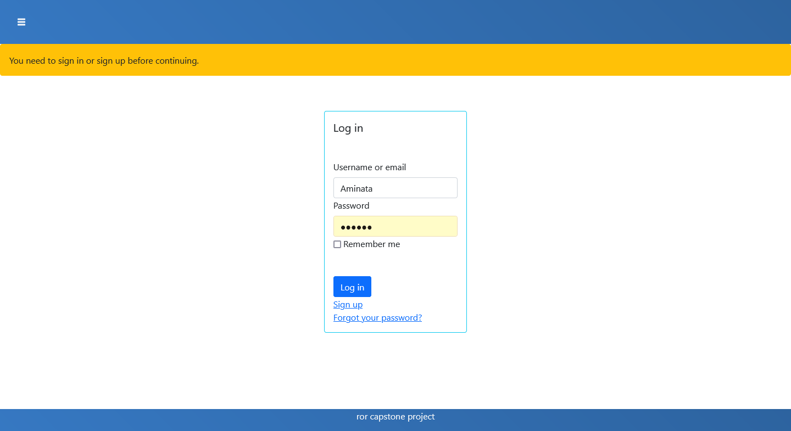
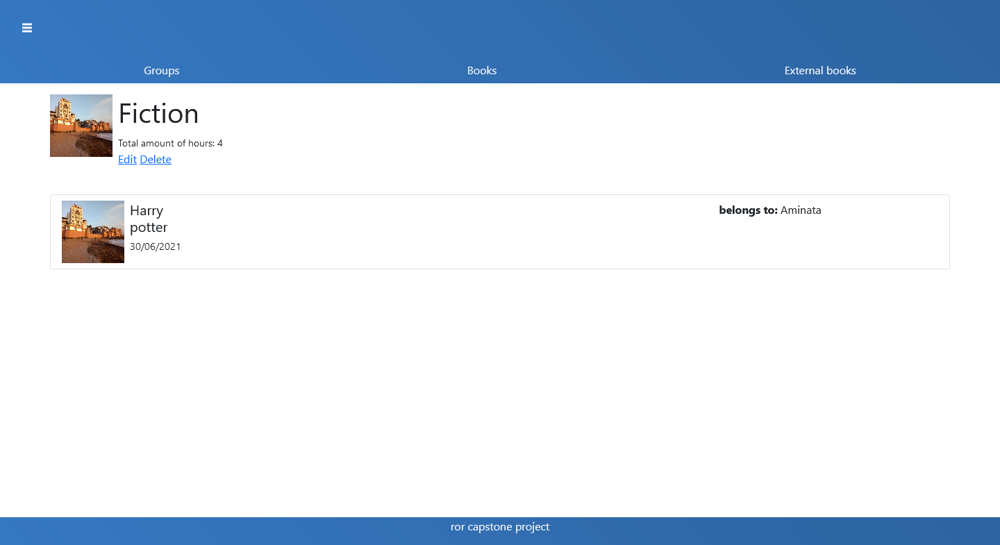

# Capstone project Book stats with Ruby on Rails

> Mini rails web application that allows users to keep track of their readings.



## Built With

- Ruby v2.7.2
- Ruby on Rails v6.1.3

## Live Demo

[live demo](https://fierce-ocean-28088.herokuapp.com/users/sign_in)


## Getting Started

To get a local copy up and running follow these simple example steps.

### Prerequisites

Ruby: 2.6.3
npm: run <code> npm install </code>
yarn
Rails: 6.1.3
Postgres: >=9.5

### Setup

Clone the repository with:
```
git clone https://github.com/safafa/ror-book-stats.git
```
Move to the root directory

Instal gems with:

```
bundle install
```

Setup database with:

```
   rails db:create
   rails db:migrate
```


### Usage

Start server with:

```
    rails server
```

Open `http://localhost:3000/` in your browser.

### Run tests

```
    rspec --format documentation
```


### Deployment

The application is deployed on heroku

## Authors

 👤 **Safa Aballagh**

- GitHub: [@Safafa](https://github.com/safafa)
- Twitter: [@safa aballagh](https://twitter.com/Aballagh_S)
- LinkedIn: [Aballagh Safa](https://www.linkedin.com/in/aballaghsafa/)


## 🤝 Contributing

Contributions, issues and feature requests are welcome!

Feel free to check the [issues page](https://github.com/safafa/ror-book-stats/issues/6).

## Show your support

Give a ⭐️ if you like this project!

## Acknowledgments
